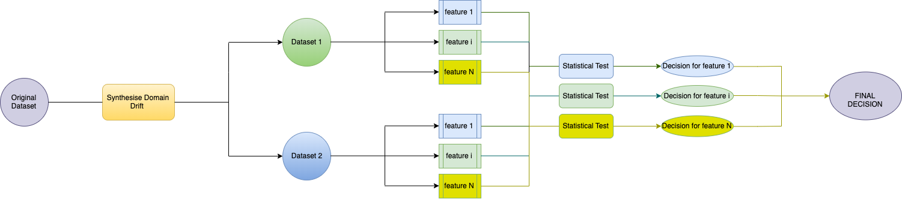
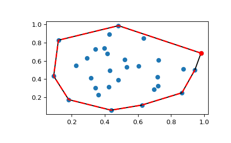

# Metric Evaluation for Domain Drift Detection 
Python Implementation of Metric Evaluation for Domain Drift Detection 
## Contributors 

* Imad Eddine Ibrahim Bekkouch ibekkouch@provectus.com

Provectus

Innopolis 

## Getting Started
Please follow the instructions to get an up and running version of our code running on your local machine.
### Prerequisites
Please make sure you have the following installed.

1. Python 3.6+
2. Scipy 1.3.0
3. scikit-learn 0.21.1
4. ctypes 1.1.0
5. opencv 4.1+

### Running the code

Run the main file with using any of the following arguments:
```
usage: main.py [-h] [--file1 {mnist,../data/iris.data}] [--file2 FILE2]
               [--type {class,cluster_removal,test_split}] [--read READ]
               [--stats_type1 {mean,same,median,delaunay,brisque,brightness,sharpness,cpbd_metric,image_colorfulness,contrast,rms_contrast,dominant_colors}]
               [--stats_type2 {mean,same,median,delaunay,brisque,brightness,sharpness,cpbd_metric,image_colorfulness,contrast,rms_contrast,dominant_colors}]
               [--test_type {two_sample_t_test,one_sample_t_test,anova,mann,kruskal,brunner,levene_mean,levene_median,levene_trimmed,sign_test,median_test,min_max,hull,ks,}]
               [--data_type DATA_TYPE] [--log_name LOG_NAME]
               [--proportiontocut PROPORTIONTOCUT]

optional arguments:
  -h, --help            show this help message and exit
  --file1 {mnist,../data/iris.data}
  --file2 FILE2
  --type {class,cluster_removal,test_split}
  --read READ
  --stats_type1 {mean,same,median,delaunay,brisque,brightness,sharpness,cpbd_metric,image_colorfulness,contrast,rms_contrast,dominant_colors}
  --stats_type2 {mean,same,median,delaunay,brisque,brightness,sharpness,cpbd_metric,image_colorfulness,contrast,rms_contrast,dominant_colors}
  --test_type {two_sample_t_test,one_sample_t_test,anova,mann,kruskal,brunner,levene_mean,levene_median,levene_trimmed,sign_test,median_test,min_max,hull,ks,}
  --data_type DATA_TYPE
  --log_name LOG_NAME
  --proportiontocut PROPORTIONTOCUT

```

## Code structure

Quick explanation of the code structure:

    .
    ├── data                          # Data Folder
    ├── graphs                        # code generated graphs
    ├── models                        # saved or pretrained models
    ├── outputs                       # experiment logs
    │   ├── Continuous                # Continuous data logs
    │   ├── Discrete                  # Discrete data logs
    │   ├── Image                     # Image data logs
    │   └── Text                      # Text data logs
    ├── CODE                          # Code
    │   ├── metrics_tests.py          # Tests for all data types
    │   │   ├──continuous_tests.py    # Conituous data types tests, mean, var ....
    │   │   ├──discrete_tests.py      # Main
    │   │   ├──image_tests.py         # Model definition (Classier, Encoder and Discriminator)
    │   │   └──time_series_tests.py   # Domain Adaptation Algorithm definition
    │   ├── data_loader.py            # Data loaders for a variety of datasets
    │   ├── main.py                   # Main
    │   ├── reporter.py               # Logging results and output formatting
    │   └── profiler.py               # Convert a dataset into statistics (feature extraction)
    ├── LICENSE                       # MIT LICENCE
    └── README.md                     # README
    
    


## Problem 
The Machine Learning field has received a lot of interest both from academic research and a technical engineering point of view.
This interest has given the field a huge boost where everyday we hear of a new model that out performs humans at most tasks.

One major drawback is that most machine learning algorithms work well on the same data they were trained on,
meaning if the data they are deployed on changed the performances drop sharply.

This opens a new field of research oriented towards unsupervised model monitoring. In this work we monitor the changes in the data as a proxy in the reduction of model's performances.

We use multiple tests to compare 2 datasets to evaluate their accuracy in detecting the changes in multiple settings. We later build a meta classifier that will use the results of multiple tests to furhter improve the accuracy of our monitoring system.

The only way to detect such changes in the data is by detecting the drop in performances of the model which requires using labeled data that are unavailable once the model has been deployed.


Although we have many different statistical tests that can detect changes between data sets, 
They are mostly evaluated on toy datasets to prove a concept.


### Questions to be answered
1. Which statistical tests are appropriate for detecting changes in the data?
2. How much does this change effect the model performances?
3. How to combine multiple statistical tests to better detect the changes?
4. When should we warn the user about these changes?
5. which models are influenced by specific changes and which models are not influenced by other changes?

## Method 1
The method we are following is direct:
1. Preprocess data to achieve synthetic domain drift.
2. Use a test to make predictions. (Take a look at the test examples described below.)
3. Compare predictions with the synthesized true labels. (Perform analysis on what statistical tests are useful.)




### 1. Preprocess data to achieve synthetic domain drift.
How do we synthesize a domain drift:
1. removing a class from the data.
2. removing a cluster from the data.

How do we synthesize a non domain drift:
1. Train/Test split.

### 2. Use a test to make predictions.
After using one of three techniques mentioned above.

We obtain two datasets:
1. Data1 (training data)
2. Data2 (deployment data) (Synthetically generated) (either a removed cluster, or a removed class or a test split)

We perform a statistical test on each feature and the result is:
1. a metric for each feature.
2. a decision for each feature.

We combine the decision per feature in three possible ways:
1. There is a change between the datasets in **all** the features.
2. **One** feature has changed.
3. The **majority** of the features have changed.


Like this we obtain a decision, **is there a change**, or **no**?


### 3. Compare predictions with the synthesized true labels.
In this step we have:
1. prediction of change using some test.
2. ground truth of change that we synthesized.

When you have access to predictions and ground truth, 
we can compute all types of binary evaluation metrics 
to evaluate how good a test is.

After that we can analyse the results of the tests and check the problems on each one 
and how can we use combine different tests to achieve better results.


## Method 2 Meta classifier
Now we have a pair of datasets (either have a domain gap or not) (the label is the existence of a domain gap)
This pair of datasets, we can perform multiple tests on them, meaning we have:
1. The label (there is a change / there is no change)
2. The features (Results of multiple tests)

| Test 1  | ... Test i ...  | Test N  | Target |
| ------  | --------------- | ------- | ------ |
| 1  | ... 0 ...  | 1  | There is a change |
| 0  | ... 1 ...  | 0  | There is a change |
| ...  | ... ... ...  | ...  | ... |
| 0  | ... 0 ...  | 0  | There is a change |
| 0  | ... 1 ...  | 1  | There is a change |


Now that we have a dataset like this we can build a classifier that gives us a probability that there is a change.
It will also help us understand the tests and present only one metric.


## Continuous Tests
### Parametric Statistical Hypothesis Tests (Testing on means)
**1. two_sample_t_test:** 
Tests whether the means of two independent samples are significantly different.

Assumptions

* Observations in each sample are independent and identically distributed (iid).
* Observations in each sample are normally distributed.
* Observations in each sample have the same variance.

Profiler

* Data1: same
* Data2: same

**2. one_sample_t_test:** 
Tests whether the means of two independent samples are significantly different.

Assumptions

* Observations in each sample are independent and identically distributed (iid).
* Observations in each sample are normally distributed.
* Observations in each sample have the same variance.

Profiler

* Data1: mean
* Data2: same

**3. ANOVA:** 
Tests whether the means of two independent samples are significantly different.

Assumptions

* Observations in each sample are independent and identically distributed (iid).
* Observations in each sample are normally distributed.
* Observations in each sample have the same variance.

Profiler

* Data1: same
* Data2: same

### Nonparametric Statistical Hypothesis Tests
#### Mean Tests
**1. Mann-Whitney U Test:** 
Tests whether the distributions of two independent samples are equal or not.
Assumptions

* Observations in each sample are independent and identically distributed (iid).
* Observations in each sample can be ranked.

Profiler

* Data1: same
* Data2: same


**2. Kruskal-Wallis H Test:** 
Tests whether the distributions of two independent samples are equal or not.
Assumptions

* Observations in each sample are independent and identically distributed (iid).
* Observations in each sample can be ranked.

Profiler

* Data1: same
* Data2: same

**3. Kruskal-Wallis H Test:** 
Tests whether values are taken one by one from each group, the probabilities of
    getting large values in both groups are equal.
    
Assumptions

* Observations in each sample are independent and identically distributed (iid).
* Observations in each sample can be ranked.

Profiler

* Data1: same
* Data2: same

#### Levene Tests for Equality of Variances
**1. Mean-based Levene Test:** 
Tests whether all input samples are from populations with equal variances
Assumptions

* Observations in each sample are independent and identically distributed (iid).
* Observations in each sample can be ranked.

Profiler

* Data1: same
* Data2: same

**2. Median-based Levene Test:** 
Tests whether all input samples are from populations with equal variances
Assumptions

* Observations in each sample are independent and identically distributed (iid).
* Observations in each sample can be ranked.

Profiler

* Data1: same
* Data2: same

**3. Trimmed Levene Test:** 
Tests whether all input samples are from populations with equal variances
Assumptions

* Observations in each sample are independent and identically distributed (iid).
* Observations in each sample can be ranked.

Profiler

* Data1: same
* Data2: same


#### Median Tests
**1. Sign Test:** 
Tests whether the difference between medians is zero.

Assumptions

* Observations in each sample are independent and identically distributed (iid).
* Observations in each sample can be ranked.

Profiler

* Data1: same
* Data2: same

**2. Mood's median test:** 

Test that two or more samples come from populations with the same median.

Assumptions

* Observations in each sample are independent and identically distributed (iid).
* Observations in each sample can be ranked.

Profiler

* Data1: same
* Data2: same


#### Coverage Tests
**1. Min-Max Test:** 
Tests whether the deployment data falls in the range of training data.

Assumptions

* Observations in each sample can be ranked.

Profiler

* Data1: same
* Data2: same

**1. hull Test:** 
Tests whether the deployment data falls in the convex hull of training data.

Assumptions

* Observations in each sample can be ranked.



Profiler
* Data1: same
* Data2: same

## APIs

Here you will find the way to deploy and use both the rest api and grpc api.

### Rest api
The rest api uses http requests and reponds in json format.

To deploy the rest api, please follow the next steps:

1. Download and the run the metric_eval container which will use the port 5000 for the service.

    ```bash
    docker run -p 5000:5000 imadeddinebek/metric_eval:0.3
    ```
2. Send the following http request:
    ```http
    http://0.0.0.0:5000/metrics?model_name=mnist-classifier&model_version=1&training=iris&deployment=iris
    ```
please specify the following values in your http request:

* model_name (ignored for now)
* model_version (ignored for now)
* training
* deployment

3. The JSON response will contain the following:

* Final Decision
* Test results, every test result contains the following:
    * final_decision: the majority decision from every feature.
    * metric: a list of the metric values for each feature.
    * decision: a list of decision for each feature.
    * p_value: a list of the p-value values for each feature.
    
    
**Example**:
Here is an example of the resulting json string for the iris dataset:
```json
{
  "anova": {
    "decision": [
      "there is no change",
      "there is no change",
      "there is no change",
      "there is no change"
    ],
    "final_decision": "there is no change",
    "metric": [
      0.0,
      7.562131837039091e-14,
      0.0,
      0.0
    ],
    "p_value": [
      1.0,
      0.9999997956196081,
      1.0,
      1.0
    ],
    "status": "succeeded"
  },
  "final_decision": "there is a change",
  "kruskal": {
    "decision": [
      "there is no change",
      "there is no change",
      "there is no change",
      "there is no change"
    ],
    "final_decision": "there is no change",
    "metric": [
      0.0,
      0.0,
      0.0,
      0.0
    ],
    "p_value": [
      1.0,
      1.0,
      1.0,
      1.0
    ],
    "status": "succeeded"
  },
  "ks": {
    "decision": [
      "there is no change",
      "there is no change",
      "there is no change",
      "there is no change"
    ],
    "final_decision": "there is no change",
    "metric": [
      0.0,
      0.0,
      0.0,
      0.0
    ],
    "p_value": [
      1.0,
      1.0,
      1.0,
      1.0
    ],
    "status": "succeeded"
  },
  "levene_mean": {
    "decision": [
      "there is no change",
      "there is no change",
      "there is no change",
      "there is no change"
    ],
    "final_decision": "there is no change",
    "metric": [
      0.0,
      0.0,
      0.0,
      0.0
    ],
    "p_value": [
      1.0,
      1.0,
      1.0,
      1.0
    ],
    "status": "succeeded"
  },
  "levene_median": {
    "decision": [
      "there is no change",
      "there is no change",
      "there is no change",
      "there is no change"
    ],
    "final_decision": "there is no change",
    "metric": [
      0.0,
      0.0,
      0.0,
      0.0
    ],
    "p_value": [
      1.0,
      1.0,
      1.0,
      1.0
    ],
    "status": "succeeded"
  },
  "levene_trimmed": {
    "decision": [
      "there is no change",
      "there is no change",
      "there is no change",
      "there is no change"
    ],
    "final_decision": "there is no change",
    "metric": [
      0.0,
      0.0,
      0.0,
      0.0
    ],
    "p_value": [
      1.0,
      1.0,
      1.0,
      1.0
    ],
    "status": "succeeded"
  },
  "mann": {
    "decision": [
      "there is no change",
      "there is no change",
      "there is no change",
      "there is no change"
    ],
    "final_decision": "there is no change",
    "metric": [
      11100.5,
      11100.5,
      11100.5,
      11100.5
    ],
    "p_value": [
      0.9994631219676353,
      0.9994612419355557,
      0.9994630482955568,
      0.9994612922080486
    ],
    "status": "succeeded"
  },
  "median_test": {
    "contingency_table": [
      [
        [
          70,
          70
        ],
        [
          79,
          79
        ]
      ],
      [
        [
          66,
          66
        ],
        [
          83,
          83
        ]
      ],
      [
        [
          71,
          71
        ],
        [
          78,
          78
        ]
      ],
      [
        [
          72,
          72
        ],
        [
          77,
          77
        ]
      ]
    ],
    "decision": [
      "there is no change",
      "there is no change",
      "there is no change",
      "there is no change"
    ],
    "final_decision": "there is no change",
    "median": [
      5.8,
      3.0,
      4.4,
      1.3
    ],
    "metric": [
      0.0,
      0.0,
      0.0,
      0.0
    ],
    "p_value": [
      1.0,
      1.0,
      1.0,
      1.0
    ],
    "status": "succeeded"
  },
  "min_max": {
    "decision": [
      "there is no change",
      "there is no change",
      "there is no change",
      "there is no change"
    ],
    "final_decision": "there is no change",
    "metric": [
      0.0,
      0.0,
      0.0,
      0.0
    ],
    "status": "succeeded"
  },
  "one_sample_t_test": {
    "decision": [
      "there is no change",
      "there is no change",
      "there is no change",
      "there is no change"
    ],
    "final_decision": "there is no change",
    "metric": [
      -2.6168662885518683e-14,
      -2.500952097930933e-14,
      -1.540305191204172e-14,
      -1.0680788732175849e-14
    ],
    "p_value": [
      0.9999999999999791,
      0.99999999999998,
      0.9999999999999878,
      0.9999999999999916
    ],
    "status": "succeeded"
  },
  "sign_test": {
    "decision": [
      "there is no change",
      "there is no change",
      "there is no change",
      "there is no change"
    ],
    "final_decision": "there is no change",
    "metric": [
      -1.0,
      4.5,
      -1.5,
      4.0
    ],
    "p_value": [
      0.9331607923848094,
      0.47085074563938245,
      0.8681591543092684,
      0.5485023614867373
    ],
    "status": "succeeded"
  },
  "two_sample_t_test": {
    "decision": [
      "there is no change",
      "there is no change",
      "there is no change",
      "there is no change"
    ],
    "final_decision": "there is no change",
    "metric": [
      0.0,
      0.0,
      0.0,
      0.0
    ],
    "p_value": [
      1.0,
      1.0,
      1.0,
      1.0
    ],
    "status": "succeeded"
  }
}
```

The rest api responds to 3 types of requests:

1. Hello request: basic test to verify that the service is up and running.
    ```http
        http://0.0.0.0:5000/
    ```
    the response will be the following: 
    ```text
    Hi! I am Domain Drift Service
    ```

2. build_info request: returns a set of information about the service.
    ```http
        http://0.0.0.0:5000/buildinfo
    ```
    the response will be the similar to the following json structure: 
    ```json
        {
      "available_routes": [
        "/buildinfo",
        "/",
        "/metrics"
      ],
      "gitCurrentBranch": "metric_evaluation",
      "name": "domain-drift",
      "pythonVersion": "3.7.4 (default, Oct 17 2019, 06:26:55) \n[GCC 6.3.0 20170516]",
      "version": "0.0.1"
         }
    ```
    
3. drift_detection request: This is the main request provided by the service.
    ```http
    http://0.0.0.0:5000/metrics?model_name=<MODEL_NAME>&model_version=<MODEL_VERSION>&training=<S3_FILE>&deployment=<S3_FILE>
    ```
    Please check the example response above.
### gRPC api

The grpc server can be launched by running the `drift_detector_service.py` file.
You will find a detailed client for how to use the grpc sever and access all 
it's information in the `drift_detector_client.py`.

The grpd server responds to 3 types of requests similarly to the REST API:
1. Hello request: basic test to verify that the service is up and running.
    * We defined the following proto messages as the request and response:
        ```proto
              syntax = "proto3";

              message HelloRequest {
              }
                
              message HelloResponse {
                    string message = 1;
              }
         ```
2. build_info request: returns a set of information about the service.
    * We defined the following proto messages as the request and response:
        ```proto
              syntax = "proto3";

              message DeployInfoRequest {
              }
                
              message DeployInfoResponse {
                  repeated string available_routes = 1;
                  string gitCurrentBranch = 2;
                  string name = 3;
                  string pythonVersion = 4;
                  string version = 5;
              }
         ```
         
3. drift_detection request: This is the main request provided by the service.
    * We defined the following proto enums:
        ````proto
            enum decision {
                THERE_IS_NO_CHANGE = 0;
                THERE_IS_A_CHANGE = 1;
            }
            
            enum status {
                FAILED = 0;
                SUCCEEDED = 1;
            }
        ````
    * We defined the following proto messages as the request and response:
        ```proto
              syntax = "proto3";

              message MetricsRequest {
                  string model_name = 1;
                  int32 model_version = 2;
                  string training = 3;
                  string deployment = 4;
              }

                
              message Test {
                  decision final_decision = 1;
                  status test_status = 2;
                  repeated decision decisions = 3;
                  repeated float metrics = 4;
                  repeated float p_values = 5;
                  string name = 6;
              }
                
              message MetricsResponse {
                  repeated Test tests = 1;
                  decision final_decision = 2;
              }
         ```
         
The final service looks like the following:
```proto
syntax = "proto3";

service DriftDetectorService {
    rpc hello (HelloRequest) returns (HelloResponse) {
    };

    rpc deployInfo (DeployInfoRequest) returns (DeployInfoResponse) {
    };

    rpc metrics (MetricsRequest) returns (MetricsResponse) {
    };
}

```

#### Python Interface with the GRPC service

The grpc service provides several methods and here is an example
on how to communicate with the service and extract the values provided.
```python
import logging

import grpc

import drift_pb2
import drift_pb2_grpc


def run():
    # NOTE(gRPC Python Team): .close() is possible on a channel and should be
    # used in circumstances in which the with statement does not fit the needs
    # of the code.
    with grpc.insecure_channel('localhost:50051') as channel:
        # Creating a link 
        stub = drift_pb2_grpc.DriftDetectorServiceStub(channel)
        
        # Sending a hello message request
        response = stub.hello(drift_pb2.HelloRequest())
        # Retrieving the response message
        print("Domain Drift Detector client received: " + response.message)
        
        # Sending a deployInfo request
        response = stub.deployInfo(drift_pb2.DeployInfoRequest())
        # Retrieving the response message
        print("Domain Drift Detector client received: ", len(response.available_routes))
        print("Domain Drift Detector client received: " + response.available_routes[0])
        print("Domain Drift Detector client received: " + response.available_routes[1])
        print("Domain Drift Detector client received: " + response.available_routes[2])
        print("Domain Drift Detector client received: " + response.gitCurrentBranch)
        print("Domain Drift Detector client received: " + response.name)
        print("Domain Drift Detector client received: " + response.pythonVersion)
        print("Domain Drift Detector client received: " + response.version)
        
        # Sending a domain drift detection request
        response = stub.metrics(drift_pb2.MetricsRequest(model_name='mnist-classifier',
                                                         model_version=1,
                                                         training='iris',
                                                         deployment='iris'))
        # Retrieving the response message
        print("Domain Drift Detector client received: ", len(response.tests))
        print("Domain Drift Detector client received: ", response.final_decision)


if __name__ == '__main__':
    logging.basicConfig()
    for i in range(3):
        run()
```
## License

This project is licensed under the MIT License - see the [LICENSE](LICENSE) file for details